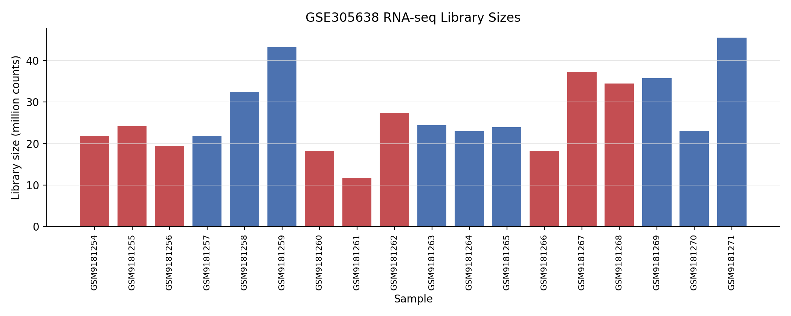
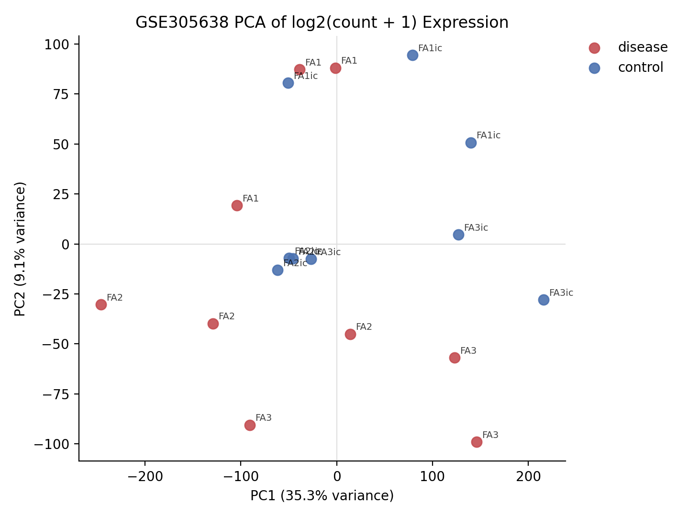
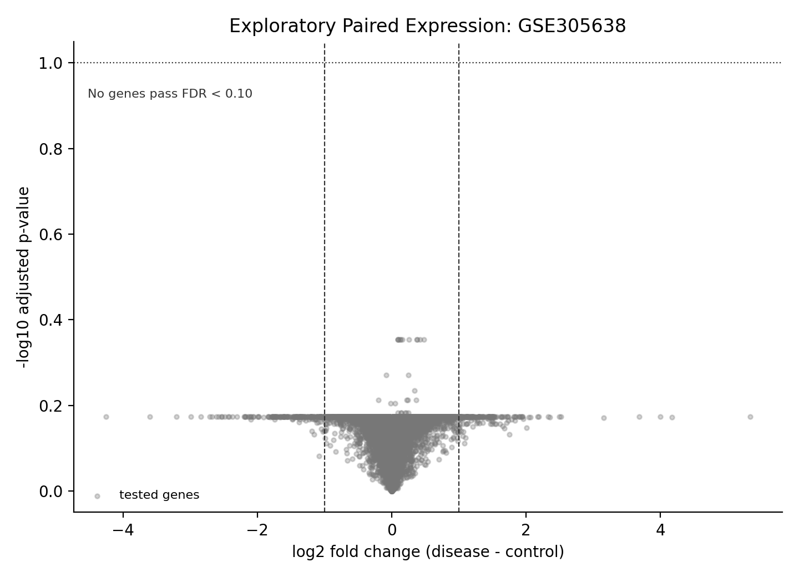
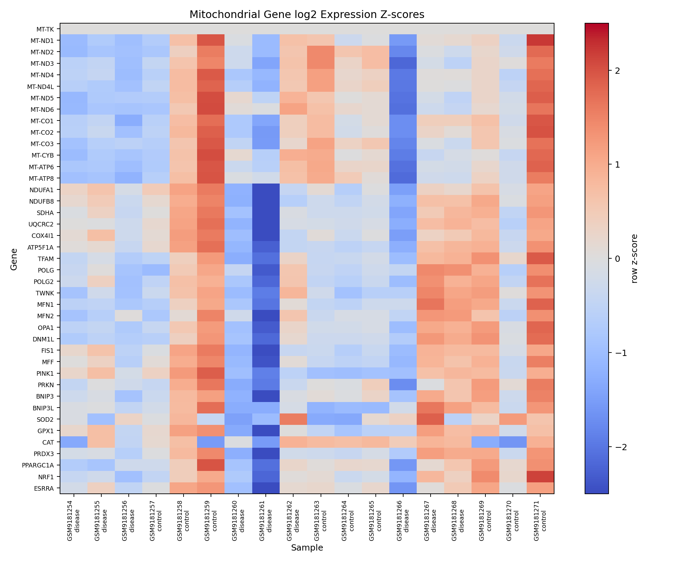
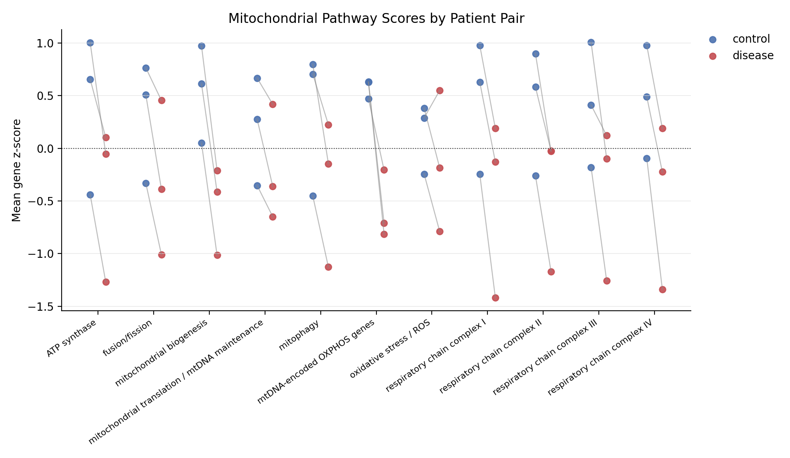
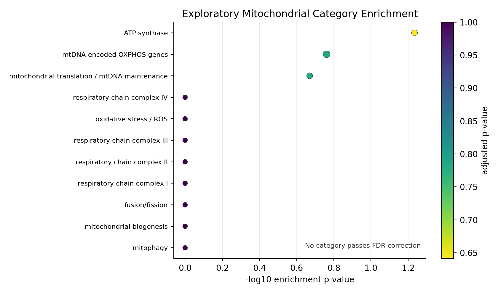

# Frataxin Deficiency iPSC-Cardiomyocyte RNA-seq Analysis

A reproducible RNA-seq workflow for public human iPSC-derived cardiomyocytes comparing Friedreich ataxia disease lines with isogenic corrected controls.

## At a Glance

| Item | Value |
|---|---|
| Disease model | Friedreich ataxia / frataxin deficiency |
| Cell type | Human iPSC-derived cardiomyocytes |
| Dataset | `GSE305638` |
| Comparison | FRDA iPSC-cardiomyocytes vs isogenic corrected controls |
| Samples | 18 total: 9 disease, 9 control |
| Design | 3 paired patient/control lines with 3 replicates per condition |
| Data type | Processed RNA-seq count matrix from GEO |
| Analysis | Metadata curation, expression QC, exploratory paired expression analysis, mitochondrial gene and pathway summaries |

## Dataset

`GSE305638` was selected because it provides a compact human cardiac disease model with processed RNA-seq data:

| Criterion | `GSE305638` |
|---|---|
| Human cells | Yes |
| iPSC-derived cardiomyocytes | Yes |
| Disease biology | Friedreich ataxia / frataxin deficiency |
| Control design | Isogenic corrected controls |
| Sample count | 18 samples |
| Paired structure | 3 patient/control line pairs |
| Processed count matrix | Yes |

The analysis uses the processed gene-count table and GEO sample metadata. No raw FASTQ files are required.

Other mitochondrial-disease datasets were screened during dataset selection. Direct MERRF-related records such as `GSE106601` and m.8344A>G-related records such as `GSE142745` were retained in the registry but were not used for the main analysis because they did not provide the same cardiac iPSC disease/control structure as `GSE305638`.

## Workflow

| Stage | Output |
|---|---|
| Dataset search and screening | `references/dataset_registry.csv` |
| Source tracking | `references/source_register.csv` |
| Metadata curation | `data/processed/metadata_clean.csv` |
| Expression QC | `data/processed/expression_clean.csv`, QC tables and figures |
| Exploratory paired expression analysis | Ranked gene table, top-gene table, volcano plot |
| Mitochondrial gene review | Mitochondrial gene table and heatmap |
| Pathway scoring | Per-sample mitochondrial category scores and paired score plot |
| Local enrichment | Exploratory mitochondrial-category over-representation table |

## Key Outputs

| Type | Path |
|---|---|
| Dataset registry | `references/dataset_registry.csv` |
| Source register | `references/source_register.csv` |
| Clean metadata | `data/processed/metadata_clean.csv` |
| Clean expression matrix | `data/processed/expression_clean.csv` |
| Expression QC summary | `reports/tables/expression_qc_summary.csv` |
| Ranked expression results | `reports/tables/differential_expression_results.csv` |
| Mitochondrial gene results | `reports/tables/mitochondrial_gene_results.csv` |
| Mitochondrial pathway scores | `reports/tables/mitochondrial_pathway_scores.csv` |
| Pathway score tests | `reports/tables/mitochondrial_pathway_score_tests.csv` |
| Local enrichment results | `reports/tables/pathway_enrichment_results.csv` |





## Results Summary

Metadata curation recovered 18 samples: 9 FRDA disease samples and 9 isogenic corrected controls across 3 paired patient/control lines.

Expression QC found:

| Metric | Value |
|---|---:|
| Gene rows | 59,743 |
| Aligned samples | 18 |
| Missing count values | 0 |
| Duplicate Ensembl gene IDs | 0 |
| Duplicate gene symbols | 3,715 |
| PCA variance, PC1 | 35.3% |
| PCA variance, PC2 | 9.1% |

The exploratory paired expression analysis tested 15,100 expressed genes after filtering. It found 859 genes with nominal `p < 0.05`, but 0 genes passed FDR `< 0.10` and 0 genes passed FDR `< 0.05`.



Ranked exploratory signals included `MEG3`, `CBLN2`, `CNTN6`, and `CHCHD2` among disease-up genes, and `TRH`, `DRD1`, `SFRP5`, and `CACNA1G` among disease-down genes. These are ranked signals from a small paired analysis, not genome-wide findings after FDR correction.

## Mitochondrial Gene and Pathway Analysis

The mitochondrial reference list contains 41 genes spanning mtDNA-encoded OXPHOS genes, respiratory-chain complexes, ATP synthase, mitochondrial translation and mtDNA maintenance, fusion/fission, mitophagy, oxidative stress / ROS, and mitochondrial biogenesis.

Gene-level review found:

| Metric | Value |
|---|---:|
| Mitochondrial genes in reference | 41 |
| Genes tested in exploratory expression table | 40 |
| `MT-TK` tested after expression filter | No |
| Lowest mitochondrial adjusted p-value | 0.671 |
| FDR-significant mitochondrial genes | 0 |

Descriptively, mtDNA-encoded OXPHOS genes trended lower in disease samples. The strongest nominal mitochondrial genes included `POLG`, `ATP5F1A`, `MT-ND2`, `MT-CO3`, and `PPARGC1A`.



Sample-level pathway scores were computed as mean z-scored expression of available genes in each mitochondrial category. All 11 categories had lower mean disease scores than paired corrected controls. The largest mean differences were seen for mtDNA-encoded OXPHOS genes, mitochondrial biogenesis, and respiratory-chain categories. These score-level results are descriptive and are not treated as confirmatory given the three-pair design.



Local mitochondrial-category enrichment used nominal `p < 0.05` genes against the tested-gene background. No category passed FDR correction. The strongest local results were ATP synthase, mtDNA-encoded OXPHOS genes, and mitochondrial translation / mtDNA maintenance, but these remain exploratory.



## Limitations

The effective paired sample size is 3 patient/control lines. Replicates were averaged within each patient/group before paired testing. This preserves the patient-pair structure, but it does not replace a larger biological cohort.

The paired expression analysis uses log2 CPM values and paired t-tests in Python. It is not a DESeq2, edgeR, or limma/voom model. The results are therefore reported as exploratory.

The mitochondrial pathway scores and local enrichment tables summarize selected gene categories. They do not establish disease mechanism, treatment response, or diagnostic claims.

## Data and References

| Resource | Role in this project |
|---|---|
| [GSE305638](https://www.ncbi.nlm.nih.gov/geo/query/acc.cgi?acc=GSE305638) | Primary iPSC-cardiomyocyte RNA-seq dataset used for analysis |
| [Frataxin deficiency drives cardiac dysfunction and transcriptional dysregulation in Friedreich ataxia iPSC model](https://www.biorxiv.org/content/10.1101/2025.08.20.671405v1) | Preprint associated with the selected FRDA iPSC-cardiomyocyte dataset |
| [GSE106601](https://www.ncbi.nlm.nih.gov/geo/query/acc.cgi?acc=GSE106601) | Mitochondrial-disease registry candidate; not used for the main analysis |
| [GSE142745](https://www.ncbi.nlm.nih.gov/geo/query/acc.cgi?acc=GSE142745) | m.8344A>G-related registry context; not used for the main analysis |

## Reproduce the Analysis

Create the environment:

```bash
conda env create -f environment.yml
conda activate frataxin-cardio-rnaseq
```

Run tests:

```bash
python -m unittest discover -s tests -v
```

Run the workflow:

```bash
python src/data/search_ncbi_geo.py
python src/data/screen_dataset_registry.py
python src/data/download_selected_dataset.py
python src/data/metadata_qc.py
python src/data/expression_qc.py
python src/analysis/differential_expression.py
python src/analysis/mitochondrial_gene_set_analysis.py
python src/analysis/mitochondrial_pathway_scores.py
python src/analysis/pathway_enrichment.py
python src/analysis/results_summary.py
```

The repository uses lightweight GEO files and processed count tables. It does not require downloading raw FASTQ files.

## Repository Structure

~~~text
frataxin-cardiomyocyte-rnaseq/
|-- data/
|   |-- raw/                 # GEO series matrix and processed count table
|   |-- interim/             # GEO/NCBI metadata files
|   +-- processed/           # cleaned metadata and expression matrices
|-- notebooks/               # notebooks 01-06 for workflow stages
|-- references/              # dataset registry, source register, gene sets
|-- reports/
|   |-- figures/             # QC, PCA, expression, mitochondrial, enrichment figures
|   +-- tables/              # QC, expression, mitochondrial, enrichment, summary tables
|-- src/
|   |-- data/                # dataset search, download, metadata, QC scripts
|   +-- analysis/            # expression, mitochondrial, enrichment, summary scripts
|-- tests/                   # unit tests for workflow logic
|-- environment.yml
|-- requirements.txt
+-- README.md
~~~
